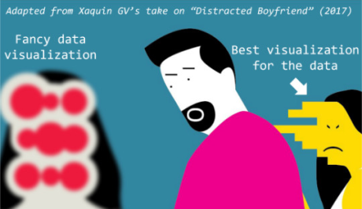

# [atet](https://github.com/atet) / [**_usct_s3e2_**](https://github.com/atet/usct_s3e2/blob/main/README.md#atet--usct_s3e2)

# U.S. Cyber Team - Season 3, Episode 2

Introduction to Data Visualization

----------------------------------------------------------------------------

## Table of Contents

* [0. Introduction](#0-introduction)

### Supplemental

* [Other Resources](#other-resources)
* [Troubleshooting](#troubleshooting)

----------------------------------------------------------------------------

## 0. Introduction

[Back to Top](#table-of-contents)

----------------------------------------------------------------------------

## Other Resources

**Description** | **URL Link**
--- | ---
 | 

[Back to Top](#table-of-contents)

----------------------------------------------------------------------------

## Troubleshooting

Issue | Solution
--- | ---
 | 

[Back to Top](#table-of-contents)

----------------------------------------------------------------------------

Copyright © 2024-∞ Athit Kao, <a href="http://www.athitkao.com/tos.html" target="_blank">Terms and Conditions</a>
